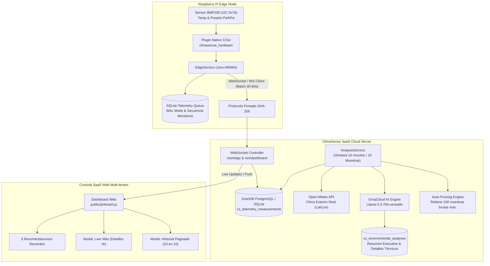

# 🌡️ ClimaSense AI - Sistema SaaS y Edge de Monitoreo Ambiental e Inteligencia Artificial

[](https://joss-lang.org)
[]()
[](https://groq.com)
[](https://raspberrypi.org)

**ClimaSense AI** es un ecosistema integral SaaS y IoT Edge diseñado para el monitoreo ambiental continuo, análisis térmico contextual y prevención de fallas en infraestructuras críticas (Salas de Servidores, Data Centers, Almacenes, Oficinas y Laboratorios).

El sistema combina hardware de bajo costo (Raspberry Pi + sensores I2C BMP280), resiliencia local offline, integración meteorológica de precisión con Open-Meteo, y un motor de **Inteligencia Artificial impulsado por GroqCloud (Llama 3.3 70B)** para generar diagnósticos ejecutivos y planes de acción paso a paso cada 10 minutos.

---

## 📐 Arquitectura General del Sistema



---

## ⚡ Características Principales

### 1. Dispositivos Edge (Raspberry Pi + BMP280)
- **Sensor I2C BMP280 Nativo:** Lecturas continuas de temperatura (°C) y presión atmosférica (`Pa` y `hPa`) vía plugin compilado ARM64.
- **Cola SQLite Offline Resiliente:** Si se pierde la conectividad a Internet, los datos se almacenan en una base de datos local SQLite en modo WAL.
- **Generador de Secuencias Monótonas:** La tabla `telemetry_meta` mantiene secuencias estrictamente crecientes (`1, 2, 3...`) evitando duplicados o rechazos al reconectarse.
- **Purga Local de 5 Minutos (`purgeStale`):** Tras sincronizar exitosamente con el servidor, la Raspberry Pi purga automáticamente los datos locales mayores a 5 minutos, manteniendo la microSD ligera.

### 2. Servidor SaaS & API Web (Joss Engine v3.6.4)
- **Procesamiento Multi-tenant Seguro:** Autenticación por roles, tokens JWT efímeros y códigos de activación de un solo uso para vincular dispositivos.
- **Monitoreo en Tiempo Real (WebSocket Live Updates):** Notificaciones instantáneas `/ws/dashboard` ante cambios de estado o llegada de telemetría.
- **Integración Abierta Open-Meteo:** Correlación automática de la temperatura interior con las condiciones meteorológicas locales exteriores mediante coordenadas GPS obtenidas vía OpenStreetMap Nominatim.

### 3. Motor de Inteligencia Artificial (GroqCloud Llama 3.3 70B)
- **Acumulación de Ventana de 10 Minutos:** El servidor acumula exactamente 10 muestras (10 minutos de telemetría) antes de invocar a la IA, garantizando un análisis estable y relevante.
- **Respuestas JSON Estructuradas:** GroqCloud genera 2 niveles de información:
  - `recommendation`: Resumen corto de 1 a 2 oraciones para la tarjeta principal.
  - `details`: Explicación técnica extendida con diagnóstico operativo, causas probables e instrucciones de acción paso a paso.
- **Respaldo Técnico Integrado (Fallback):** Si no hay API Key o falla la conexión con GroqCloud, el motor de reglas local genera automáticamente las explicaciones técnicas operativas.

### 4. Higiene y Optimización de la Base de Datos (Auto-Pruning)
- **Purga de Telemetría Bruta:** Después de cada análisis de IA, el servidor elimina de la tabla `cs_telemetry_measurements` las muestras antiguas, reteniendo únicamente las **100 más recientes** por dispositivo para renderizar gráficas continuas sin saturar la BD.

### 5. Interfaz de Usuario de Alta Estética (Landing Page y Dashboard)
- **Landing Page Pública en `/`:** Presentación completa del proyecto, arquitectura de hardware, capacidades de IA, requisitos y guía de instalación.
- **Vista de Recomendaciones (Máximo 3):** Muestra sólo las 3 recomendaciones más recientes en el panel principal para evitar sobrecarga visual.
- **Botón `[ Leer más ]`:** Abre un modal con el análisis detallado generado por GroqCloud AI.
- **Historial Completo Paginado (10 de 10):** Modal interactivo con paginación cronológica completa del historial de análisis.

---

## 📋 Requisitos del Sistema

### Hardware (Nodo Edge Raspberry Pi)
- **Placa:** Raspberry Pi (Zero W / Zero 2 W / 3B+ / 4B / 5).
- **Sensor:** BMP280 conectado por bus I2C (`Dirección 0x76` en SDA/SCL).
- **Almacenamiento:** Tarjeta MicroSD (mínimo 4 GB) con Raspberry Pi OS (64-bit).
- **Conectividad:** Wi-Fi o Ethernet.

### Software & Infraestructura (Servidor SaaS)
- **Runtime:** Joss Engine v3.6.4 (ARM64 o x86_64 Linux).
- **Base de Datos:** PostgreSQL 14+ (Producción) o SQLite (Desarrollo / Tests).
- **Servidor Web:** HestiaCP / Nginx / Reverse Proxy con soporte WebSocket (WSS).
- **API Key Opcional:** GroqCloud API Key (`GROQ_API_KEY`) para Llama-3.3-70b.

---

## 🛠️ Variables de Entorno (`env.joss` / `.env`)

```ini
# Configuración general
JOSS_ENV=production
APP_KEY=secret_app_key_climasense
JWT_SECRET=secret_jwt_climasense

# Servidor HTTP & WebSocket
PORT=18080
SESSION_COOKIE_SECURE=true

# Base de Datos PostgreSQL (HestiaCP / Producción)
DB_DRIVER=postgres
POSTGRES_HOST=hestia.josprox.com
POSTGRES_PORT=5432
POSTGRES_DB=josprox_climasense
POSTGRES_USER=josprox_climasense
POSTGRES_PASSWORD=tu_password_seguro

# Motor de IA GroqCloud (Opcional)
GROQ_API_KEY=gsk_your_groq_api_key_here

# Frecuencia de Análisis (Segundos)
ANALYSIS_INTERVAL_SECONDS=600
ANALYSIS_MIN_SAMPLES=10
```

---

## 🚀 Guía de Instalación y Despliegue

### 1. Servidor SaaS

```bash
# Clonar repositorio y seleccionar rama server
git checkout server

# Instalar ejecutable Joss y verificar tests
./scripts/bootstrap.sh
./scripts/test.sh

# Iniciar servidor
./dist/joss server
```

### 2. Nodo Edge en Raspberry Pi

```bash
# Compilar paquete instalador desde la rama edge
git checkout edge
./scripts/build-runtime.sh
./scripts/build-plugins.sh
./scripts/build-edge.sh
./scripts/build-raspios-bundle.sh

# Transferir climasense-raspios-installer.tar.gz a la Raspberry Pi y ejecutar:
cd ~/Downloads
tar -xzf climasense-raspios-installer.tar.gz -C /tmp/climasense_install
cd /tmp/climasense_install
sudo sh os/raspios/install.sh
sudo reboot
```

---

## 🧪 Verificación de Pruebas

El conjunto de pruebas automatizado valida end-to-end:
- Rutas públicas (`/`, `/login`, `/register`, `/setup`).
- API REST autenticada y flujos de tokens WebSocket efímeros.
- Recepción de lotes de telemetría firmados por dispositivos Edge.
- Análisis de 10 minutos con Open-Meteo y GroqCloud AI.
- Poda automática de mediciones brutas en base de datos.

```bash
./scripts/test.sh
```

---

## 📜 Licencia
Proyecto desarrollado para el Curso de Sistemas Inteligentes - **ClimaSense AI Engine v3.6.4**.
